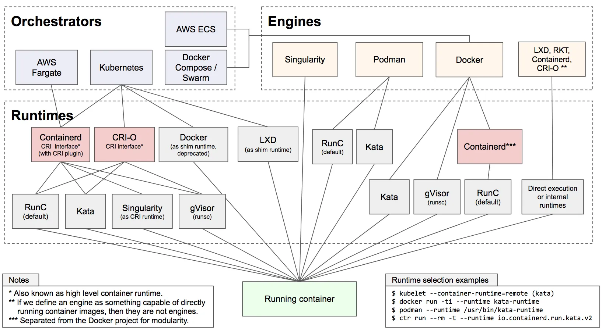
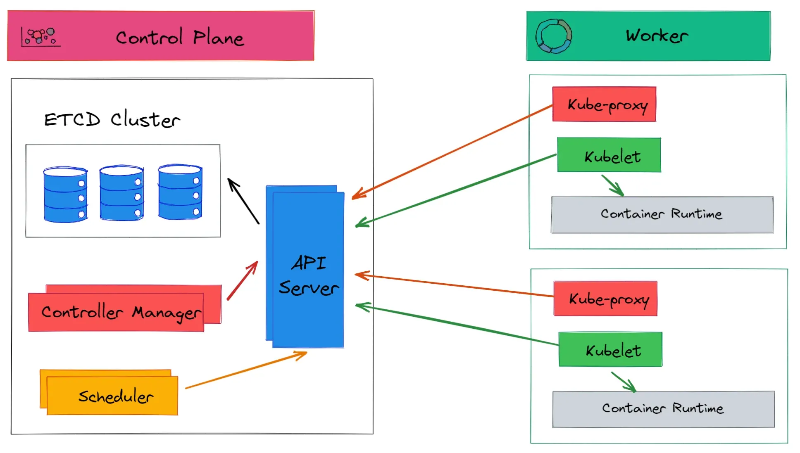
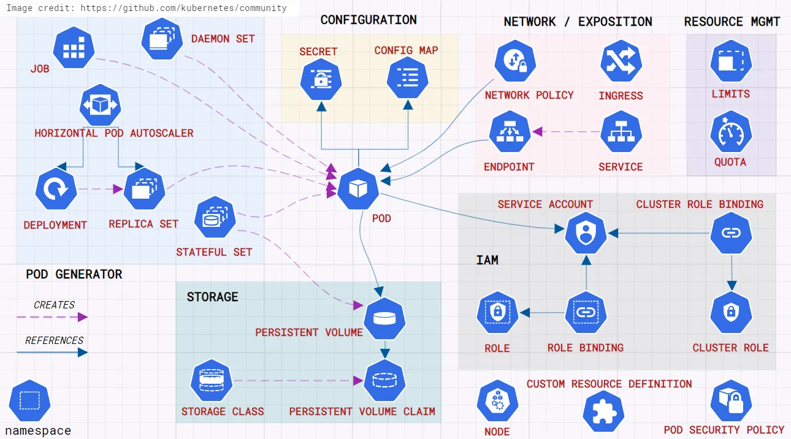

# Container

Container é uma isolamento de recurso, ele é como um “micro S.O”, onde se isola não somente memoria e CPU e etc, mas todos componentes do S.O.

Ele utiliza os recursos do host, além do recursos computacionais, mas também do kernel, libs e etc do host onde ele esta.

## Container engine

É responsável pela configuração do container.

Ex.: Docker, podman e etc

## Container runtime

Responsável pela comunicação do container engine com o kernel do host e execução do container.

existe alguns  tipos de runtimes e os mais utilizados são os de low level e high level

### **Low level**

Runtimes que se comunicam direto com o kernel do host.

### **High level**

Não se comunica direto com o kernel e precisam de uma engine para essa comunicação.

Ex.: Containerd, cri-o e o proprio docker.

### **Open Container Initiative (OCI)**

A **Open Container Initiative (OCI)** é um projeto da **Linux Foundation** criado em 2015 para padronizar os formatos e tempos de execução de containers. O objetivo da OCI é garantir a portabilidade e compatibilidade entre diferentes plataformas e ferramentas de containers, evitando lock-in em tecnologias proprietárias.

Os principais componentes da OCI são:

1. **OCI Runtime Specification** – Define como um container deve ser executado (exemplo: `runc`).
2. **OCI Image Specification** – Define o formato das imagens de container.
3. **OCI Distribution Specification** – Define como as imagens são armazenadas e distribuídas (exemplo: registro de imagens como Docker Hub).

Esses padrões garantem que qualquer runtime compatível com OCI possa rodar imagens OCI sem depender de um runtime específico, promovendo interoperabilidade entre diferentes tecnologias de containerização.

## Orquestrador de container

Um **orquestrador de containers** é uma ferramenta que automatiza a implantação, o gerenciamento, o escalonamento e a operação de containers em um ambiente distribuído. Ele garante que os containers estejam sempre rodando, reiniciando-os se falharem, balanceando carga e gerenciando a comunicação entre eles.

Os principais orquestradores são:

- **Kubernetes** – O mais popular, amplamente usado em produção.
- **Docker Swarm** – Solução nativa do Docker, mais simples, mas menos escalável.
- **Nomad** – Mais leve e flexível, suporta múltiplos tipos de workload.

Orquestradores são essenciais para ambientes de **microservices** e **cloud-native**, garantindo alta disponibilidade e escalabilidade automática.

# Arquitetura do k8s

## Control Plane

O control plane do Kubernetes é o componente central responsável pela orquestração e gerenciamento de um cluster Kubernetes.

Ele possui vários componentes que trabalham juntos para manter o estado do cluster, esses são:

### **etcd**

É um banco de dados (chave/valor) responsável por guardar todos os valores referentes a configuração e estado do cluster.

### api-server

É responsavel por todo comunicação dentro de um cluster, entre os componentes do control plane e dos nodes (workers).

### **scheduler**

É um agendador que defina onde a aplicações serão executadas dentro de um nó em um pod.

### control-manager

Responsável pela verificação do estado atual do cluster e o estado
desejado, bem como as ações necessárias para recuperá-lo.

### cloud-manager

Tem a mesma função do control-manager, porem especifico para nuvem.

## Worker

Um **worker node** (nó de trabalho) em um cluster Kubernetes é uma máquina (física ou virtual) responsável por executar os **pods**, que contêm os containers das aplicações. Ele recebe instruções do **control plane** (nó mestre) e gerencia a execução dos workloads.

Os principais componentes de um worker node são:

### Kubelet

É um serviço presente em todas as máquinas integrantes do cluster - inclusive do
master - seu papel é interagir com a API do servidor para atualizar o estado da máquina e
iniciar novos trabalhos oriundos do scheduler. O kubelet é o serviço que se comunica com o
container runtime.

### Kube-proxy

É um dos pods estáticos presentes em todas as máquinas. Seu papel é prover
o “load balancing” básico, direcionando o tráfego para os serviços específicos.

# Portas de comunicação

O k8s utiliza diversas portas para comunicação entre seus componentes. Aqui estão as principais portas usadas no cluster:

## **Control Plane (Nó Mestre)**

- **6443** (TCP) – API Server (TLS) – Comunicação com `kubectl`, `kubelet` e outros componentes.
- **2379-2380** (TCP) – etcd – Armazena o estado do cluster.
- **10250** (TCP) – Kubelet no nó mestre – Monitoramento e controle remoto.
- **10251** (TCP) – Kube-Scheduler – Planejamento da alocação de pods.
- **10252** (TCP) – Kube-Controller-Manager – Gerenciamento dos controladores do cluster.

## **Worker Nodes (Nós de Trabalho)**

- **10250** (TCP) – Kubelet – Comunicação com o API Server.
- **10255** (TCP) *(obsoleto, usado em versões antigas)* – Kubelet (não seguro, sem TLS).
- **30000-32767** (TCP) – NodePort – Serviços expostos externamente pelo Kubernetes.

## Outros Serviços Importantes

- Weavenet (TCP/UDP) – 6783-6784

# Objetos do k8s

Os principais objetos do k8s são:

- Pod - Menor unidade dentro do cluster
- Deployment - Provisionamento de um ou mais pods, utilizando o replicaset.
- Namespaces - Separar aplicações por “grupos” de forma isolada.
- Service - Fazer a exposição de uma aplicação de forma externa.
- ConfigMap - Definição do mapa de configuração de uma aplicação
- Secret - Responsável para armazenar senhas, chaves.
- PersistentVolume - Persistencia de dados dentro de um container.
- PersistenVolumeClaim - Criação de areas dentro de um volume.
- Ingress - Definição de um nome para um serviço

Outro objetos do cluster

- Replicaset - Utilizado para controlar o numero de replicas.
- DaemonSet - Responsável em criar e distribuir um recurso entre os nós
- Volumes -  armazenar os dados de um pod.
- Job - Para executar uma tarefa.
- CronJobs - Agendar uma tarefa.
- Init Containers - Contêineres iniciados dentro de um pod antes dos container principal.

# Kubectl

O kubectl é a ferramenta de linha de comando para comunicação com o plano de controle (control plane) de um cluster k8s, utilizando a API do Kubernetes.

[Install kubectl](https://kubernetes.io/docs/tasks/tools/install-kubectl-linux/)

# Kind (k8s in docker)

Kind é uma forma de utilizar um cluster local em sua maquina.

[Kind](https://kind.sigs.k8s.io/docs/user/quick-start/#installation)